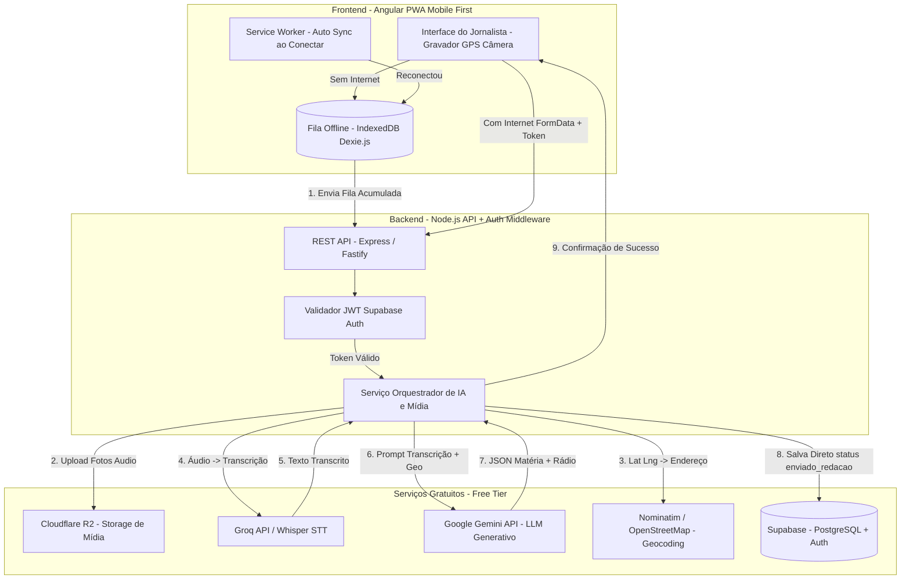

# Arquitetura e Plano de Desenvolvimento: MVP de Jornalismo de Campo

## Descrição do Projeto
MVP de aplicação web PWA (Angular + Node.js) voltado para jornalistas de campo reportarem notícias via dispositivo móvel de forma rápida, intuitiva e automatizada. O sistema captura fotos, áudio e localização GPS, e utiliza inteligência artificial para transcrever o relato e gerar dois entregáveis instantâneos enviados diretamente à redação:
1. **Matéria jornalística formatada** para portal web (com título, lead, corpo, tags e legenda da foto).
2. **Roteiro otimizado para rádio/podcast** (texto direto, dinâmico, marcas de tempo e pronúncia clara).

## Decisões de Arquitetura Alinhadas com o Cliente
> [!IMPORTANT]
> **Fluxo Direto Sem Edição Mobile**: Para cobrir a falha de tempo dos jornalistas em campo, o conteúdo gerado pela IA **não é editável no celular**. Ao concluir o processamento, a matéria e o roteiro são salvos diretamente no banco de dados com status `enviado_redacao`.

> [!TIP]
> **Modo Offline Robusto**: Implementação de fila local no navegador (IndexedDB via Dexie.js). Se o jornalista estiver sem sinal 4G no campo, o áudio, fotos e coordenadas ficam salvos localmente e são **sincronizados automaticamente** assim que a conexão for restabelecida.

> [!NOTE]
> **Estratégia de Autenticação (Supabase Auth)**: Para manter a simplicidade e permitir fácil evolução para login/senha sem complicação de infraestrutura, utilizaremos o **Supabase Auth**. O backend verificará o token JWT em cada requisição.

---

## 1. Arquitetura do Sistema e Fluxo de Comunicação

### Diagrama de Arquitetura (Mermaid)

### Detalhamento do Fluxo de Comunicação:
1. **Captura & Fila Offline (Angular PWA)**:
   - Gravador de áudio (`MediaRecorder`), fotos (`Camera API`) e GPS (`navigator.geolocation`).
   - Se houver conexão: dados enviados imediatamente via `FormData` com cabeçalho `Authorization: Bearer <JWT>`.
   - Se estiver **offline**: o report é salvo na fila local IndexedDB. Um banner exibe *"3 matérias aguardando conexão"*. Ao detectar sinal, o Service Worker envia a fila automaticamente.
2. **Autenticação Simplificada (Como Funciona)**:
   - **No Celular**: O jornalista faz login uma única vez com e-mail/senha. O aplicativo guarda um token seguro (JWT).
   - **No Backend**: O backend Node.js apenas valida se esse token é válido usando a chave pública do Supabase. Não é necessário gerenciar senhas ou sessões no backend!
3. **Processamento Automático no Backend**:
   - Upload de mídias para o **Cloudflare R2** (sem custo de saída).
   - Geocodificação reversa via **Nominatim / OpenStreetMap**.
   - Transcrição do áudio gravado via **Groq (Whisper Large v3)**.
   - Geração de matéria (Portal) e roteiro (Rádio) via **Google Gemini 1.5/2.0 Flash**.
   - Persistência direta no **Supabase PostgreSQL** com status `enviado_redacao`.

---

## 2. Stack de Serviços (Seleção Focada em Menor Custo / Free Tier Generoso)

| Categoria | Serviço Selecionado | Por que esta escolha? | Custo / Limites Free Tier |
|---|---|---|---|
| **Mapas e Geocodificação** | **Nominatim (OpenStreetMap)** | 100% gratuito, sem cartão de crédito e sem limite de chave de API para geocodificação reversa. | **$0.00** |
| **Armazenamento de Mídia** | **Cloudflare R2** | Compatível com S3, **0 taxas de saída (egress fees)**, inclui 10 GB de armazenamento gratuito mensal. | **$0.00** (até 10GB) |
| **Transcrição de Áudio (STT)** | **Groq API (Whisper Large v3)** | Transcrição via hardware LPU ultra-rápido com excelente acurácia em português. | **$0.00** (Free Tier) |
| **LLM (Matéria + Rádio)** | **Google AI Studio (Gemini 2.0 Flash)** | Modelo de IA de alta velocidade, resposta em formato JSON estruturado e **tier gratuito generoso**. | **$0.00** (Google AI Studio) |
| **Banco de Dados & Auth** | **Supabase (PostgreSQL + Auth)** | Gerencia usuários (E-mail/Senha), tokens JWT e banco PostgreSQL sem precisar programar auth do zero. | **$0.00** (Free Tier 500MB) |
| **Fila Offline (Client)** | **Dexie.js (IndexedDB)** | Biblioteca leve em JS/TS para gerenciar armazenamento local de áudios/fotos no celular. | **$0.00** |
| **Hospedagem Frontend** | **Vercel** ou **Cloudflare Pages** | Hospedagem PWA Angular via Git com SSL e CDN global. | **$0.00** |
| **Hospedagem Backend** | **Render** ou **Vercel Serverless** | Servidor Node.js leve ou Serverless Functions. | **$0.00** |

---

## 3. Roadmap de Desenvolvimento Atualizado (MVP em 4 Fases)

### Fase 1: Setup da Base, Banco e Autenticação Supabase (Semana 1)
- [ ] Configuração do projeto Supabase (Tabelas `journalists`, `reports`, `media_files` e políticas de segurança RLS).
- [ ] Configuração da autenticação por E-mail/Senha no Supabase Auth.
- [ ] Setup do repositório em `noticiatodahora` (Frontend Angular + Backend Node.js Express/TypeScript).
- [ ] Criação do Middleware de Autenticação JWT no Node.js.

### Fase 2: Backend, Integração de IAs e Pipeline de Mídia (Semana 2)
- [ ] Implementar upload de arquivos multipart para Cloudflare R2.
- [ ] Implementar serviço de transcrição de áudio via Groq (Whisper v3).
- [ ] Implementar chamada ao Gemini 2.0 Flash com JSON Schema (Gerando Matéria Portal + Roteiro Rádio).
- [ ] Implementar persistência direta no banco Supabase com status `enviado_redacao`.

### Fase 3: Frontend Angular Mobile/PWA + Fila Offline IndexedDB (Semana 3)
- [ ] Interface mobile-first enxuta para gravação de áudio (`MediaRecorder`), câmera e GPS.
- [ ] Implementar módulo de login simples com e-mail/senha.
- [ ] Implementar Fila Offline usando Dexie.js (IndexedDB): se sem internet, grava no celular; se online, dispara envio.
- [ ] Service Worker e listener `online/offline` para sincronização automática da fila.
- [ ] Tela de confirmação e status da fila (ex: "Matéria enviada com sucesso à redação").

### Fase 4: Testes de Campo, Ajustes de Prompt e Deploy (Semana 4)
- [ ] Testes práticos simulando perda de sinal 4G durante a gravação e re-conexão.
- [ ] Refinamento do tom jornalístico no prompt do Gemini para garantir formato final sem necessidade de edição.
- [ ] Deploy do Frontend (Vercel/Cloudflare Pages) e Backend (Render/Vercel).

---

## Plan Verification
- **Teste de Carga Offline**: Simulação de desligamento da rede no DevTools, gravação de 3 relatos e verificação da sincronização automática ao reativar a rede.
- **Validação de Auth**: Garantir que requisições sem token JWT válido sejam rejeitadas com erro HTTP 401.
